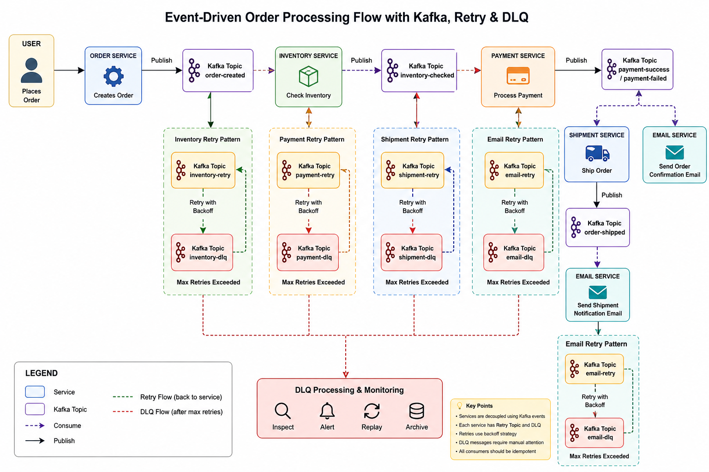

# SpringBoot4-OrderProcessing-Kafka-SAGA

# Because of the limited resources, I am creating all the services in one project
# Please create different microservices for each service below and the related database.
# Clear responsibilities, APIs, and database design per service.

# Download the kafka -  kafka_2.13-4.2.0
# TO START KAFKA -   bin/kafka-server-start.sh config/server.properties
# Stop Kafka with Ctrl + C
# TO CHECK ALL TOPIC - bin/kafka-topics.sh --bootstrap-server localhost:9092 --list

 

1 - UserService 
2 - OrderService 
3 - ProductService 
4 - InventoryService 
5 - PaymentService 
6 - ShippingService 
7 - EmailNotificationService 
  

| Service                  | DB | Responsibility |
|--------------------------| -------- | -------- |
| UserService              |	user_db	| User management
| OrderService             |	order_db	| Orders
| ProductService           |	product_db	| Products
| InventoryService	        | inventory_db	| Stock
| PaymentService	          | payment_db	| Payments
| ShippingService	         | shipping_db	| Delivery
| EmailNotificationService |	notification_db	| Notifications

  

  
# SpringBoot4-Dashboard-Inventory-Management-API
https://github.com/pravinpachbhai/SpringBoot4-Dashboard-Inventory-Management-API

